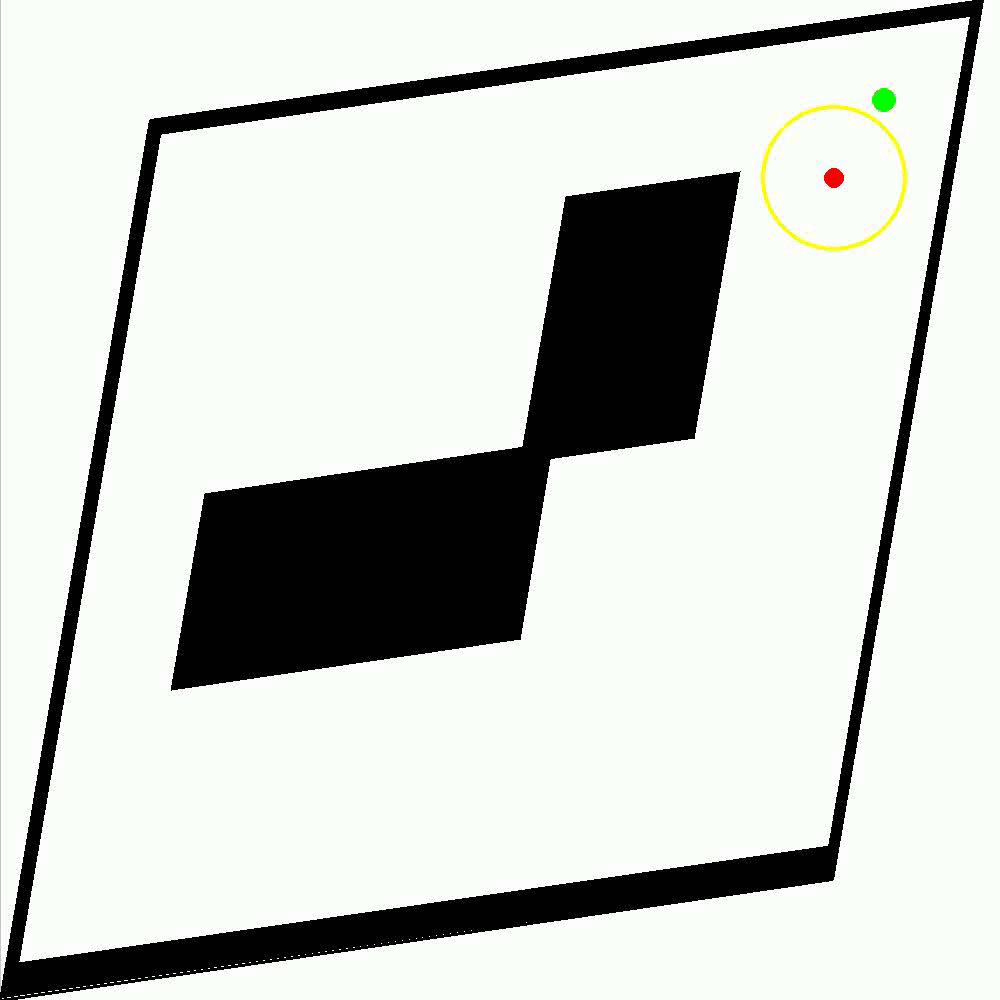

# Deformed Gridworld for Reinforcement Learning

A reinforcement learning environment featuring a deformable gridworld with partial observability for studying POMDPs (Partially Observable Markov Decision Processes) and belief space planning.

## Project Description

This project implements a deformable gridworld environment where the grid space can be stretched and sheared, creating a challenging partially observable environment for reinforcement learning algorithms. The primary features include:

- **Deformable grid space**: Configurable stretching and shearing transformations of the environment
- **Partial observability**: Agents have limited observation capabilities based on configurable models
- **POMDP framework**: Support for both fully and partially observable approaches
- **Belief space planning**: Implementation of belief updating mechanisms using various approaches (Bayesian Particle Filters, Variational Inference)
- **Multiple agent implementations**: Including QMDP, Thompson Sampling, Infotaxis and more
- **Interactive visualization**: Real-time rendering of both the original and deformed gridworld

The environment is designed to study how agents can learn and navigate in spaces where the physical properties of the environment are unknown and must be inferred from partial observations.

<p align="center">
    
</p>


## Project Structure

```
.
├── src/                       # Source code
│   ├── agents/                # Agent implementations (QMDP, infotaxis, etc.)
│   ├── config/                # Configuration classes
│   ├── environment/           # Environment implementations
│   │   ├── cpp_env_continous/ # C++ implementation of the gridworld
│   │   └── env.py             # Python wrappers and environment classes
│   ├── obs_model/             # Observation models
│   └── utils/                 # Utility functions including belief updating
├── tests/                     # Test files
│   ├── agents/                # Tests for agents
│   └── environment/           # Tests for environments
├── docs/                      # Documentation
├── scripts/                   # Jupyter notebooks and utility scripts
│   ├── agent.ipynb            # Agent evaluation and experimentation notebook
│   ├── train                  # Agent Training
│   └── eval                   # Agent Evaluation 
├── models/                    # Pre-trained models
│   ├── MDP/                   # Trained MDP models (DQN, PPO)
│   ├── Obs_Model/             # Trained observation models
│   └── POMDP/                 # POMDP-related models
└── requirements.txt           # Project dependencies
```

## Core Components

### Environments

- **ObservableDeformedGridworld**: Base environment with deformation capabilities
- **Grid**: Gym-compatible wrapper for the C++ gridworld implementation
- **POMDPDeformedGridworld**: Partially observable version with custom observation models
- **BeliefSpacePOMDP**: Extended POMDP with built-in belief state tracking

### Agent Types

- **QMDP**: Q-MDP algorithm for POMDP planning
- **Infotaxis**: Information-based exploration strategy
- **Thompson Sampling (TS)**: Probabilistic action selection based on beliefs
- **Maximum Likelihood Sampling (MLS)**: Action selection based on most likely state

### Belief Update Mechanisms

- **Discrete**: Belief updates using discretized state space
- **Variational Inference**: Belief updates using Beta variational Bayesian inference
- **Particle Filters**: Belief updates using Bayesian particle filtering

## Getting Started

### Prerequisites

- Python 3.8+
- PyTorch 2.0+
- Gymnasium (formerly OpenAI Gym)
- PyGame (for visualization)
- NumPy, SciPy
- pybind11 (for C++ binding)
- A C++ compiler (for building the C++ components)

### Installation

```bash
# Clone the repository
git clone https://github.com/yourusername/deformed-gridworld.git
cd deformed-gridworld

# Install dependencies
pip install -r requirements.txt

# Install the package in development mode
pip install -e .
```

### Building C++ Components

```bash
cd src/environment/cpp_env_continous
python setup.py build_ext --inplace
```

## Usage

### Basic Usage

```python
from src.environment import POMDPDeformedGridworld
from src.obs_model import load_obs_model

# Load observation model
obs_model = load_obs_model('cardinal')

# Create environment
env = POMDPDeformedGridworld(obs_type='cardinal', render_mode='human')

# Reset the environment
state, _ = env.reset()

# Take actions in the environment
for _ in range(100):
    action = env.action_space.sample()  # Replace with your agent's policy
    next_state, reward, terminated, truncated, info = env.step(action)
    
    if terminated or truncated:
        break
        
env.close()
```

### Using Pre-trained Models

```python
from stable_baselines3 import PPO, DQN
from src.environment import Grid

# Create environment
env = Grid(
    shear_range=(-0.2, 0.2),
    stretch_range=(0.4, 1.0),
    render_mode="human"
)

# Load pre-trained model
model = PPO.load("models/MDP/PPO_continous_exxq5no6/rl_model_4500000_steps", env=env)

# Use the model
obs, _ = env.reset()
while True:
    action, _ = model.predict(obs, deterministic=True)
    obs, reward, terminated, truncated, info = env.step(action)
    env.render()
    if terminated or truncated:
        break

env.close()
```

### Belief-based Planning

```python
from src.environment import POMDPDeformedGridworld
from src.agents import QMDP
from src.obs_model import load_obs_model

# Load components
obs_model = load_obs_model('cardinal')
mdp_model = PPO.load("models/MDP/PPO_continous_exxq5no6/rl_model_4500000_steps")

# Create environment
env = POMDPDeformedGridworld(obs_type='cardinal', render_mode='human')

# Create belief-based agent
agent = QMDP(
    mdp_agent=mdp_model,
    pomdp_env=env,
    update='particlefilters',
    obs_model=obs_model,
    discretization=1000
)

# Run episode
obs, _ = env.reset()
while True:
    action, _ = agent.predict(obs)
    obs, reward, terminated, truncated, info = env.step(action)
    if terminated or truncated:
        break

env.close()
```

## Interactive Obstacle Creation

The environment includes a feature to interactively create obstacles:

```python
from src.environment import Grid

# Create obstacles interactively
obstacles = Grid.create_obstacles_interactively()

# Use the created obstacles in an environment
env = Grid(obstacles=obstacles, render_mode='human')
```

## Testing

```bash
# Run all tests
pytest

# Run specific test modules
pytest tests/environment/test_pomdp_deformed_gridworld.py
```

## Documentation

Detailed documentation can be found in the `docs/` directory.

## License

This project is licensed under the MIT License - see the LICENSE file for details.